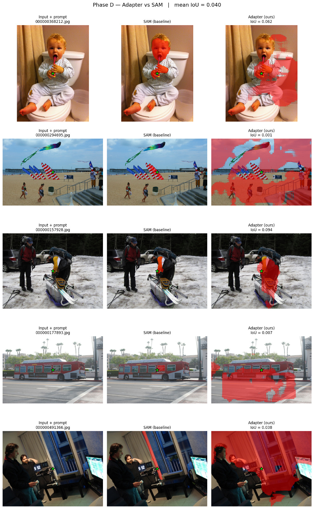

# Unified Perception: can one vision encoder feed both OWL and SAM?

An experiment in running open-vocabulary detection (NanoOWL) and segmentation (NanoSAM)
on an NVIDIA Jetson Orin NX without paying for two separate image encoders.

**Result: it did not work with this approach.** A small adapter that maps OWL's
encoder features into SAM's feature space trains cleanly but produces unusable
masks. This repo documents the idea, the test that exposed the problem, and what
I learned. The result was also raised upstream with NVIDIA:
[NVIDIA-AI-IOT/nanosam#42](https://github.com/NVIDIA-AI-IOT/nanosam/issues/42).

---

## The idea

On an edge device, the most expensive part of a detect-and-segment pipeline is the
vision encoder, and this pipeline runs two of them every frame: one inside OWL (for
detection) and one inside SAM (for segmentation). They look at the same image.

So the question was: can I run OWL's encoder once and feed its features into SAM's
mask decoder through a small adapter, and skip SAM's encoder entirely? If it worked,
it would roughly halve the per-frame encoding cost.

```
Normal pipeline (two encoders):
  image ──> OWL encoder ──> OWL detection
  image ──> SAM encoder ──> SAM decoder ──> masks

Proposed (one encoder + adapter):
  image ──> OWL encoder ──┬──> OWL detection
                          └──> adapter ──> SAM decoder ──> masks
```

## What I built

A small adapter network (`nanosam/adapter.py`, ~525K parameters) that converts OWL's
output shape into the shape SAM's decoder expects:

- OWL outputs `(576, 768)`: a 24x24 grid of patches, each a 768-dim vector.
- SAM's decoder expects `(256, 64, 64)`: a 64x64 grid of 256-dim vectors.

The adapter reshapes the tokens to a 24x24 grid, upsamples it to 64x64, and maps
768 dimensions down to 256 with a two-layer MLP. I trained it on COCO images to make
its output match SAM's real encoder output, using a mix of mean-squared-error and
cosine-similarity loss, with both encoders frozen.

Training converged nicely: validation loss settled around 0.065. By that number alone
the adapter looked done.

## How I tested whether it actually works

Matching the encoder's features is only a proxy. What matters is whether SAM's
decoder produces a correct mask from the adapter's features. So I ran the real test:
take an image, place a point on an object, and compare two masks from the *same* SAM
decoder with the *same* prompt, changing only where the features come from.

- **Baseline:** image -> SAM's real encoder -> decoder -> mask
- **Adapter:** image -> OWL encoder -> adapter -> decoder -> mask

I measured agreement with **IoU** (intersection over union): how much the two masks
overlap. 1.0 means identical, 0 means no overlap at all.

Run it yourself: `python compare_masks.py`

### The result

**Mean IoU was 0.04** across random COCO images. The adapter's masks barely overlap
with SAM's.



Left: the input image with a center-point prompt. Middle: real SAM, clean and precise.
Right: the adapter, blocky patches that do not even land on the prompted object.

## Why it did not work

- **A low training loss was misleading.** The adapter learned to match SAM's features
  *on average*, but the decoder needs the right spatial structure, and average feature
  error does not capture that. The loss looked great while the output was unusable.
- **Resolution is part of it.** OWL's 24x24 grid is much coarser than SAM's 64x64.
  Upsampling 24 to 64 cannot invent detail that was never captured, which is where the
  blocky artifacts come from.
- **But resolution is not the whole story.** The masks are not just blurry, they are in
  the wrong place. That points to the training objective being the bigger problem, not
  just the grid size.

## What I would try next

- **Train against masks, not features.** Instead of matching SAM's encoder output,
  backpropagate through SAM's decoder against ground-truth masks, so the adapter is
  rewarded for producing correct masks rather than similar-looking features. This is
  the approach most likely to work, and also the largest effort.
- **A finer OWL backbone** (OWL-ViT-B/16 gives a 48x48 grid) would reduce the
  resolution gap, though on its own it would not fix the localization problem.

## Repository

```
nanosam/adapter.py      the adapter network
nanosam/encoders.py     frozen OWL and SAM encoders (feature extraction)
nanosam/trainer.py      training loop
train.py                training entry point
compare_masks.py        the end-to-end IoU test that produced the result above
tests/test_adapter.py   unit tests for the adapter shapes and gradients
ARCHITECTURE.md         detailed feature-dimension analysis and design notes
assets/                 the mask comparison figure
```

## Credits

Built on top of NVIDIA's [NanoOWL](https://github.com/NVIDIA-AI-IOT/nanoowl) and
[NanoSAM](https://github.com/NVIDIA-AI-IOT/nanosam), which wrap Google's
[OWL-ViT](https://arxiv.org/abs/2205.06230) and Meta's
[Segment Anything](https://arxiv.org/abs/2304.02643). Licensed Apache 2.0, matching
the upstream projects.
